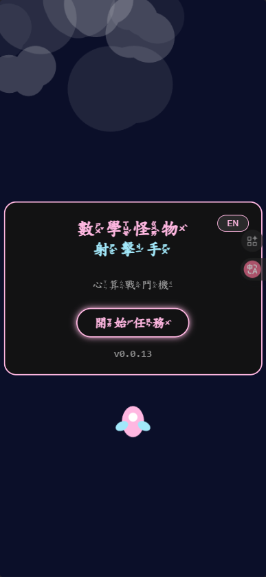

# Math Monsters Shooter (數學怪物射手)

## 📖 專案概述 (Project Overview)
這是一個結合數學教育與射擊遊戲的瀏覽器應用程式。玩家駕駛飛船，透過計算加減法題目來發射子彈，擊退不斷來襲的數字怪物。目標是提供國小低年級學生一個充滿趣味的計算練習環境。

## 🕹️ 試玩網址
https://math-monsters-shooter.liawchiisen.workers.dev/



## 🛠 技術架構 (Technical Stack)
- **Core Framework**: Vue 3 + Vite
- **Rendering**: HTML5 Canvas (用於高效能粒子與遊戲渲染)
- **Styling**: Vanilla CSS (Neon Space 風格)
- **Audio**: Web Audio API (零依賴音效)
- **State Management**: Vue Reactivity API

## 🏗 模組架構 (Architecture)

### 核心邏輯 (src/logic/)
- **GameEngine.js**: 遊戲核心驅動器。負責處理 Canvas 的繪圖循環 (RequestAnimationFrame)、管理遊戲階段轉換、怪物生成時間控制、以及全局減速特效等核心遊戲邏輯。
- **EntityManager.js**: 實體管理器。負責追蹤並更新畫面上的所有動態實體（包括玩家、怪物、子彈與粒子），並處理實體超出邊界後的清理工作，是維持高效能渲染的關鍵。
- **MathSystem.js**: 數學題目生成系統。專為國小一年級程度設計，能產生總和 20 以內的加法或被減數 20 以內的減法題目，並智慧生成接近正確答案的干擾選項。
- **Collision.js**: 碰撞偵測系統。封裝了圓形碰撞、點與圓形碰撞的數學運算，確保射擊與目標互動的準確性。
- **SoundManager.js**: 音效與音樂管理器。基於 Web Audio API 實現程序化音效合成，無需加載外部音檔即可產生豐富的射擊、爆炸及動態背景音樂。
- **TTSManager.js**: 語音合成管理器。整合瀏覽器原生 Speech Synthesis 技術，為遊戲提供即時的語音讀數與心理建設鼓勵語句。

### 應用程式入口與配置 (src/)
- **App.vue**: 應用程式主容器與中央狀態機。協調全域遊戲狀態、管理得分與生命值邏輯、處理 TTS 播放排程，並作為所有子組件的通訊中樞。
- **main.js**: 應用程式啟動入口。負責初始化 Vue 應用環境、註冊 i18n 多國語言插件。
- **i18n.js**: 國際化設定檔。定義了中英文雙語的介面文本、語系切換規則，支援動態語系更迭。

### UI 組件 (src/components/)
- **GameCanvas.vue**: 遊戲渲染組件。將純 JS 寫寫的遊戲引擎嵌入 Vue 生態系，負責 Canvas 的 DOM 生命週期、視窗縮放適配（Resize）以及引擎啟動/暫停。
- **GameHUD.vue**: 抬頭顯示資訊層。負責在遊戲畫面頂部穩定顯示即時分數、生命心形圖標，並整合了全局靜音切換與暫停按鈕，具備極高的 Z-index 層級。
- **AnswerPanel.vue**: 互動答案面板。動態生成浮動在畫面底部的數字按鈕，支援觸控與語音反饋，是玩家進行答題的核心操作介面。
- **StartScreen.vue**: 視覺與引導入口。展示遊戲標題與設定介面（如語言切換），並提供流暢的遊戲開始切換動畫。

## 🎨 視覺風格 (Visual Aesthetics)
- **Theme**: Neon Space (霓虹太空)
- **Palette**: Deep Space Blue (#0B0F29) 背景，搭配 Neon Cyan (#00F3FF) 與 Magenta (#FF00FF) 強調色。
- **Effects**: 粒子爆炸、光暈 (Glow)、毛玻璃 (Glassmorphism) UI。

## ✅ 實作計畫 (Implementation Plan)

### Phase 1: Initialization & Foundation
- [x] 初始化 Vue 3 + Vite 專案
- [x] 設定基礎 CSS 變數 (Design Tokens) 與全域樣式
- [x] 建立專案目錄結構 (logic, components, assets)

### Phase 2: Core Logic Implementation
- [x] 實作 `MathSystem.js` (題目生成邏輯)
- [x] 實作 `GameEngine.js` (基礎 Loop 與 Canvas setup)
- [x] 實作 `EntityManager.js` (怪物生成與移動)

### Phase 3: UI & Interaction
- [x] 建立 `GameCanvas.vue` 整合 Canvas
- [x] 建立 `AnswerPanel.vue` (底部互動按鈕)
- [x] 串接射擊邏輯與碰撞偵測

### Phase 4: Polish & Effects
- [x] 加入粒子爆炸與發光特效
- [x] 加入音效處理 (Web Audio API)
- [x] 優化 UI 動畫與轉場 (Start Screen, Game Over)


## 🛠️ 字型優化與維護 (Font Optimization)

為了提升網頁載入速度，我們將 13MB 的 `ZhuyinFont.ttf` 透過子集化壓縮至 50KB 左右的 `ZhuyinFont.woff2`。當有新增中文翻譯時，請務必重新執行此流程。

### 子集化內容來源 (Charset Sources)
1.  **基礎英數與符號 (Basic ASCII & Math Symbols)**: `A-Z a-z 0-9 + - * / = ? : . % !`
2.  **注音符號 (Bopomofo)**: `U+3100-312F` 完整區段
3.  **UI 中文文本 (From src/i18n.js)**: 遊戲介面用字

#### 完整字元清單 (Copy This):
```text
ABCDEFGHIJKLMNOPQRSTUVWXYZabcdefghijklmnopqrstuvwxyz0123456789+-*/=?:.%! ㄅㄆㄇㄈㄉㄊㄋㄌㄍㄎㄏㄐㄑㄒㄓㄔㄕㄖㄗㄘㄙㄧㄨㄩㄚㄛㄜㄝㄞㄟㄠㄡㄢㄣㄤㄥㄦˊˇˋ˙數學怪物射擊手心算戰鬥機開始任務得分生命等待目標遊戲結束最終分數重新載入中暫停繼續離開恭喜你破關差一點錯了不對唷唉怎麼可能好棒讚真厲害完美百一
```

### 更新流程 (Update Workflow)
1.  **準備**: 複製上方的「完整字元清單」。若有新增 UI 文字，請手動加入清單中。
2.  **工具**: 前往 [Transfonter.org](https://transfonter.org/)
3.  **設定**:
    *   **Add fonts**: 上傳 `public/fonts/ZhuyinFont.ttf`
    *   **Subsets**: **全部取消勾選 (None)** (避免混入無用字元)
    *   **Characters**: 貼上剛才的「完整字元清單」
    *   **Formats**: 勾選 `WOFF2`
4.  **轉換**: 點擊 `Convert` -> `Download`
5.  **替換**: 將下載後的 `.woff2` 檔案重新命名為 `ZhuyinFont.woff2` 並覆蓋專案中的 `public/fonts/ZhuyinFont.woff2`。

---
*Created by Antigravity Assistant*
Math Monsters Shooter 國小一年級加減法遊戲練習
